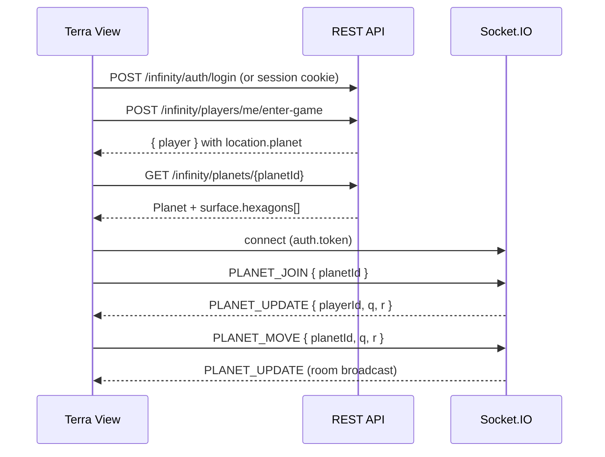

# Server Requirements for Terra View — First Page (Hexagonal Surface)

```yaml
date: 2026-06-13
author: Roro LeSage
model: Composer
sources:
  - ../../../infinity/documentation/infinity-api.md
  - ../../../infinity/documentation/planets/hexagonal-planet-specification.md
  - ../../../infinity/documentation/first-planet/first-planet-specifications.md
  - ../../../infinity/documentation/wip/player-location/player-location.md
```

---

## Overview

This document maps **Terra View first-page** needs (hexagonal planetary surface around the player) to the **current Infinity server API**. It lists what is already implemented, what the client should call today, and what remains missing or deferred.

**Canonical API reference:** [infinity-api.md](../../../infinity/documentation/infinity-api.md)

**Prerequisites**

- Authenticated player with a session cookie (`infinity_token`) or Bearer JWT.
- After first spawn, `Player.location` is at **planet depth** with `planet.id` and `hex_coords`.
- Terra View loads the full planet document and joins the planet Socket.IO room for live position sync.

---

## Implemented API (use today)

### Authentication

| Aspect | Value |
|--------|-------|
| Mechanism | JWT in `httpOnly` cookie `infinity_token` or `Authorization: Bearer <jwt>` |
| Session restore | `GET /infinity/auth/me` (JWT) |
| First-world bootstrap | `POST /infinity/players/me/enter-game` (JWT) |

Planet and resource REST routes are **public** (no JWT). Player spawn and location routes require JWT. See [auth.md](../../../infinity/documentation/auth.md).

---

### Player location and spawn

Position is stored on the `Player` entity as contextual **`location`** (PostgreSQL JSONB), not a separate position resource.

| Method | Route | Auth | Description |
|--------|-------|------|-------------|
| `POST` | `/infinity/players/me/enter-game` | JWT | Bootstrap first spawn or return existing player |
| `GET` | `/infinity/players/:userId` | Public | Get or create player profile (includes `location`) |
| `PATCH` | `/infinity/players/me/location` | JWT | Replace full `location` object |
| `POST` | `/infinity/players/me/location/enter-planet` | JWT | Star system → planet (`planetId`, `q`, `r`) |
| `POST` | `/infinity/players/me/location/leave-planet` | JWT | Planet → star system (`x`, `y`) |

**`POST /infinity/players/me/enter-game` response (planet depth after spawn)**

```json
{
  "player": {
    "id": "a1b2c3d4-e5f6-7890-abcd-ef1234567890",
    "userId": "f47ac10b-58cc-4372-a567-0e02b2c3d479",
    "location": {
      "cube": { "id": "550e8400-e29b-41d4-a716-446655440000" },
      "starSystem": { "id": "661e8400-e29b-41d4-a716-446655440001" },
      "planet": {
        "id": "661e8400-e29b-41d4-a716-446655440001_planet_0",
        "hex_coords": { "q": 2, "r": 5 }
      }
    },
    "createdAt": "2026-06-11T12:00:00.000Z",
    "updatedAt": "2026-06-11T12:05:00.000Z"
  }
}
```

| Field | Terra View usage |
|-------|------------------|
| `player.location.planet.id` | `planetId` for `GET /infinity/planets/:planetId` and `PLANET_JOIN` |
| `player.location.planet.hex_coords` | Initial camera / player hex `{ q, r }` |

Spec: [player-location.md](../../../infinity/documentation/wip/player-location/player-location.md)

---

### Planet surface (REST)

| Method | Route | Auth | Description |
|--------|-------|------|-------------|
| `GET` | `/infinity/planets/:planetId` | Public | Get or generate planet document with full `surface.hexagons[]` |
| `GET` | `/infinity/resources/planet/:planetId` | Public | List resource nodes from the `resources` collection |

**Query parameter (first entry only)**

| Name | Required | Description |
|------|----------|-------------|
| `systemId` | Yes on first materialization | Parent star UUID (`StarSystem._id`) |

**`GET /infinity/planets/:planetId` response (surface excerpt)**

```json
{
  "_id": "661e8400-e29b-41d4-a716-446655440001_planet_0",
  "name": "Planet 1",
  "starSystemId": "661e8400-e29b-41d4-a716-446655440001",
  "type": "rocky",
  "radius": 5,
  "resources": { "iron": 420, "gold": 75, "water": 1300 },
  "surface": {
    "hexagons": [
      {
        "biome": "desert",
        "resources": [],
        "dangerLevel": 3,
        "coordinates": { "q": 0, "r": 0 }
      }
    ],
    "generatedAt": "2026-06-11T12:00:00.000Z"
  }
}
```

| Field | Notes |
|-------|-------|
| `radius` | Odd integer 5–15; grid has **`radius × radius`** hex cells |
| `surface.hexagons[].coordinates` | Axial `{ q, r }`, `0 ≤ q, r < radius` |
| `surface.hexagons[].biome` | `desert`, `forest`, `ocean`, `mountain`, `ice`, `volcanic` |
| `surface.hexagons[].resources` | Per-hex deposits — **empty array in current MVP** |
| `type: gas` | **422** — no enterable surface |

Hex domain rules: [hexagonal-planet-specification.md](../../../infinity/documentation/planets/hexagonal-planet-specification.md)

---

### Real-time planet sync (Socket.IO)

Connect to `http://localhost:4000` (no `/infinity` prefix). Authenticated handlers require JWT via `auth: { token }` on connect.

| Direction | Event | Description |
|-----------|-------|-------------|
| Client → Server | `PLANET_JOIN` | Join room `planetId`; restore or roll spawn hex |
| Client → Server | `PLANET_MOVE` | Move on surface `{ planetId, q, r }` |
| Client → Server | `PLANET_LEAVE` | Leave planet room |
| Server → Client | `PLANET_UPDATE` | `{ playerId, planetId, q, r }` broadcast to room |
| Server → Client | `PLANET_ERROR` | Handler errors |

`PLANET_MOVE` persists `planet.hex_coords` in PostgreSQL and broadcasts to the planet room. There is no dedicated REST patch for hex moves within planet depth (use Socket.IO or `PATCH /infinity/players/me/location` with the full location object).

---

### Recommended Terra View client flow



Optional: `GET /infinity/resources/planet/:planetId` for separate resource-node documents (aggregate `resources` on the planet document is also available).

---

## Hexagonal coordinate system (server)

The server uses **axial coordinates** `(q, r)` on a **toroidal** grid — not cube `(x, y, z)` or offset coordinates.

| Aspect | Server behavior |
|--------|-----------------|
| System | Axial `(q, r)` with modulo wrap at edges |
| Bounds | `0 ≤ q, r < radius` |
| Player position | `Player.location.planet.hex_coords` and Socket.IO `PLANET_*` events |
| Tile identity | `surface.hexagons[].coordinates` |

The earlier proposal to standardize on cube coordinates does **not** match the implemented API. Terra View must convert axial ↔ screen pixels per [hexagonal-planet-specification.md](../../../infinity/documentation/planets/hexagonal-planet-specification.md).

---

## Gaps and deferred items (still missing for Terra View)

These items were assumed in early Terra View planning but are **not** in the current server API.

### REST endpoints not implemented

| Proposed route | Status | Workaround |
|----------------|--------|------------|
| `GET /infinity/players/me/position` | Not implemented | Use `POST /infinity/players/me/enter-game` or `GET /infinity/players/:userId` → `location.planet` |
| `POST /infinity/players/me/position` | Not implemented | Use `PLANET_MOVE` (Socket.IO) or `PATCH /infinity/players/me/location` |
| `GET /infinity/planets` | Not implemented | Not required for first-page spawn; `enter-game` provides `planet.id` |
| `GET /infinity/planets/:planetId/surface` | Not implemented | Full surface returned by `GET /infinity/planets/:planetId` |

### Viewport / streaming surface

There is no endpoint to fetch **tiles around a center hex** with a ring radius or zoom level. The client receives the **entire** `surface.hexagons[]` array (up to `radius²` cells, e.g. 225 when `radius` is 15). For the first page this is acceptable at current planet sizes; a viewport API may be needed later for performance.

### Data shape mismatches (early draft vs API)

| Early draft field | Current API |
|-------------------|-------------|
| `coordinates.x/y/z` (cube) | `coordinates.q/r` (axial) |
| `terrainType` | `biome` |
| `elevation` | Not exposed |
| `rotation` on position | Not exposed |
| `hexagonalGrid.size/orientation` on planet | Use `radius` + axial spec |
| `tileSize` | Client rendering concern |

### MVP limitations

| Item | Status |
|------|--------|
| Per-hex `surface.hexagons[].resources` | Always `[]` in MVP |
| `GET /infinity/resources/planet/:planetId` | Separate collection; not auto-populated on planet generation |
| Move validation (neighbors, bounds) | `PLANET_MOVE` accepts all coordinates in MVP |
| JWT on `GET /infinity/planets/:planetId` | Intentionally **public** |

### Security note (corrected)

`GET /infinity/players/:userId` is **intentionally public** per [infinity-api.md](../../../infinity/documentation/infinity-api.md). Securing it with JWT is not a current server requirement. Sensitive player actions use `/infinity/players/me/*` routes with JWT.

---

## Summary

| Category | Item | Priority | Status |
|----------|------|----------|--------|
| Spawn | `POST /infinity/players/me/enter-game` | High | **Implemented** |
| Position read | `Player.location.planet` on player profile | High | **Implemented** |
| Surface load | `GET /infinity/planets/:planetId` | High | **Implemented** |
| Live movement | `PLANET_JOIN` / `PLANET_MOVE` / `PLANET_UPDATE` | High | **Implemented** |
| Coordinates | Axial `(q, r)` toroidal grid | High | **Implemented** |
| Resources (aggregate) | `Planet.resources` on planet document | Medium | **Implemented** |
| Resources (nodes) | `GET /infinity/resources/planet/:planetId` | Medium | **Implemented** (collection may be empty) |
| Viewport surface | `GET …/surface?centerQ&centerR&rings` | Low | **Missing** |
| Planet list | `GET /infinity/planets` | Low | **Missing** (not needed for first page) |
| Dedicated position REST | `GET/POST …/players/me/position` | Low | **Missing** (superseded by location model + sockets) |
| Per-hex resources | `surface.hexagons[].resources` | Medium | **Deferred** (empty in MVP) |
| REST hex move | `PATCH …/location/planet` | Low | **Missing** (use Socket.IO) |

---

## Terra View implementation order

1. **Session** — rely on `infinity_token` cookie (`withCredentials: true`); optional `GET /infinity/auth/me` on load.
2. **Bootstrap** — `POST /infinity/players/me/enter-game` → read `location.planet.id` and `hex_coords`.
3. **Surface** — `GET /infinity/planets/:planetId` → render `surface.hexagons[]` around player hex.
4. **Real-time** — Socket.IO `PLANET_JOIN` then `PLANET_MOVE`; listen for `PLANET_UPDATE`.
5. **Hex math** — axial `(q, r)` ↔ pixels per hex spec; handle toroidal wrap client-side if needed.
6. **Later** — viewport API, per-hex resources, move validation when server adds them.
